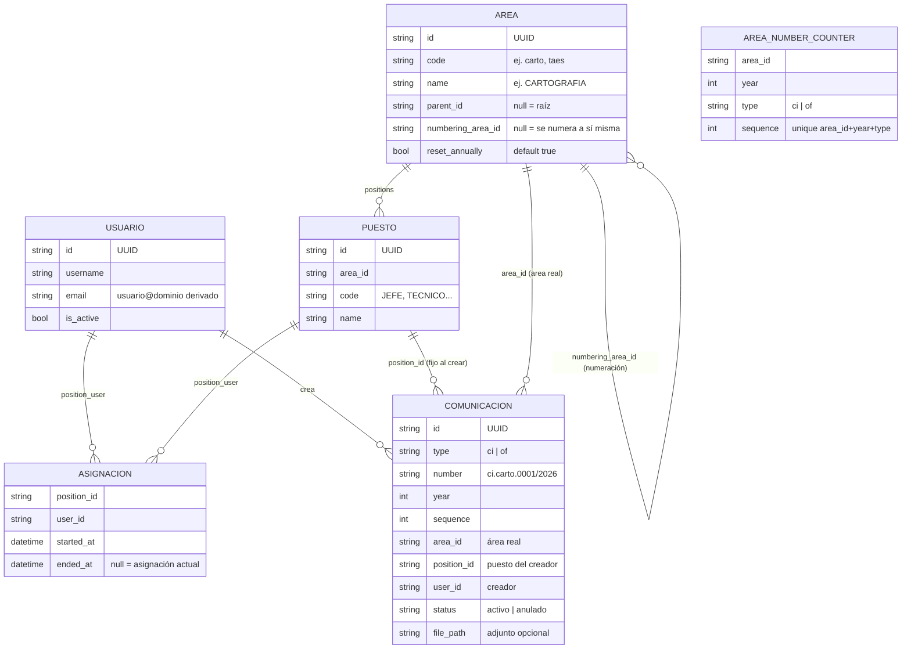
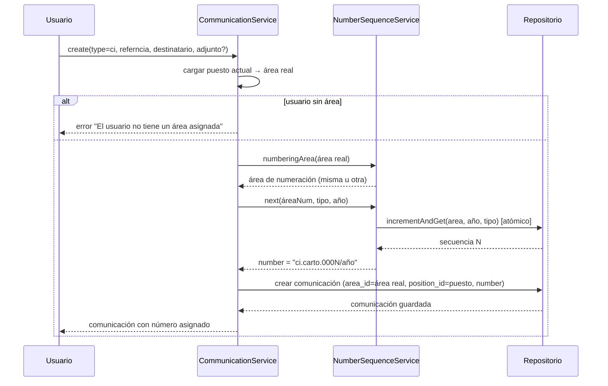
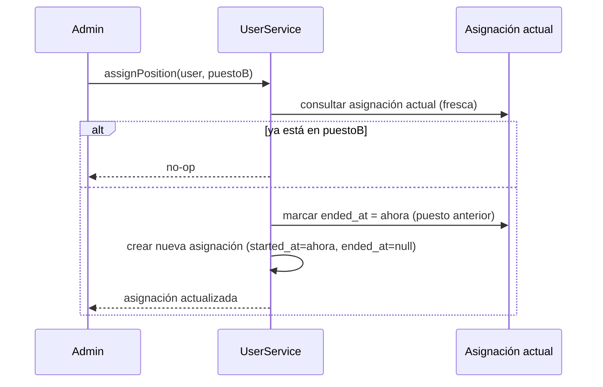

# Lógica de Negocio — Carto (Exportación autocontenida)

> Este paquete contiene la **lógica de negocio pura** del sistema de comunicaciones Carto, desacoplada del stack (Laravel/Inertia/React). Su objetivo es poder reimplementar el sistema en cualquier otro stack conservando las reglas de negocio.
>
> Contenido:
>
> 1. [Modelo de dominio](#modelo-de-dominio)
> 2. [Reglas del correlativo](#reglas-del-correlativo)
> 3. [Flujo: creación de comunicación](#flujo-creación-de-comunicación)
> 4. [Flujo: asignación de puesto](#flujo-asignación-de-puesto)
> 5. [Reinicio de numeración](#reinicio-de-numeración)
> 6. [Reglas de estados y permisos](#reglas-de-estados-y-permisos)
> 7. [Invariantes clave](#invariantes-clave)
> 8. [Contratos de persistencia](#contratos-de-persistencia)

---

## Modelo de dominio



- **Áreas** = departamentos reales en un árbol recursivo.
- **Puestos** = cargos dentro de un área; el área de un usuario se deriva de su puesto actual.
- **Comunicaciones** = documentos con correlativo, creados por un usuario desde su puesto actual.

## Reglas del correlativo

### Formato

```
prefijo.codigo_area.secuencia/año
ci.carto.0001/2026
```

- `prefijo`: `ci` (comunicación interna) u `of` (oficio externo).
- `codigo_area`: código del **área de numeración** en minúsculas.
- `secuencia`: entero con 4 dígitos de ancho (`0001`, `0011`).
- `año`: año de emisión (`2026`).

### Contador

- Vive en `area_number_counters` con clave única `(area_id, year, type)`.
- La asignación del siguiente número es **atómica** (incremento + lectura en una sola operación) para evitar duplicados concurrentes.
- **El número nunca se reutiliza**, aunque la comunicación se anule.

### Numeración configurable por área

- Cada área puede apuntar a otra vía `numbering_area_id`.
- Si está configurada, la comunicación usa la **secuencia y el prefijo del área apuntada** (ej. un área configurada para numerar como CARTOGRAFIA genera `ci.carto.000X`).
- `area_id` de la comunicación conserva el **área real**, no la de numeración.
- Resolución de **un solo nivel**: el área apuntada se usa tal cual, no se sigue resolviendo.
- La auto-referencia (`numbering_area_id = propia id`) se descarta.

## Flujo: creación de comunicación



- Antes de guardar, la UI muestra el **siguiente número** (`current()`: `sequence+1`) — es informativo; el número definitivo lo asigna `next()` al guardar.
- `position_id` se fija al crear y no cambia aunque el usuario cambie de puesto después.

## Flujo: asignación de puesto



- La pertenencia se registra en `position_user` (historial completo).
- **Asignación actual** = fila con `ended_at = NULL`.
- **Quitar puesto**: `removeFromCurrentPosition` marca `ended_at` sin borrar el historial.
- ⚠️ **Gotcha**: siempre consultar la asignación actual fresca. La relación cacheada causa asignaciones duplicadas.

## Reinicio de numeración

```mermaid
flowchart TD
    A[POST admin/areas/{id}/reset-numbering] --> B{¿Force?}
    B -->|no| C{¿Año actual ya emitió números<br/>para esta área o áreas que<br/>numeran como ella?}
    C -->|sí| D[BLOQUEADO: no reinicia]
    C -->|no| E[Reinicia contadores a 0]
    B -->|sí| E
    E --> F[Nuevos correlativos pueden duplicar<br/>números ya emitidos]

    G[areas.reset_annually] --> H{¿true?}
    H -->|true| I[Secuencia reinicia en 0001 cada año]
    H -->|false| J[Secuencia continúa del año previo<br/>solo si no existe fila del año]
```

- `areas.reset_annually` (default `true`): la secuencia reinicia en `0001` cada año (`ci.carto.0001/2027`) o continúa del previo (`ci.carto.0011/2027`).
- El fallback "continuar" solo aplica cuando **no existe fila** del año en `area_number_counters`.
- El reinicio manual acepta `types` (`ci`/`of`, mínimo 1) y `force`.
- Con `force=true` reinicia igual conservando las comunicaciones; los correlativos nuevos **pueden duplicar** números ya emitidos (la columna `number` deja de ser única).

## Reglas de estados y permisos

- Roles: **administrador** (gestiona usuarios/áreas/puestos/marca) y **usuario** (perfil + comunicaciones propias).
- No existe registro público ni recuperación de contraseña: solo el admin crea cuentas y resetea contraseñas.
- Reset de contraseña o desactivar un usuario **invalida sus sesiones**.
- Eliminar un usuario se bloquea si creó comunicaciones (para nunca perder correlativos por cascada).
- Estado de comunicación: `activo` → `anulado`. **Anular no libera el número**.
- **Solo el creador** puede editar una comunicación mientras esté `activo`.
- La comunicación anulada queda consultable (histórico) pero oculta del listado por defecto.
- Eliminar un área se bloquea si tiene hijos, puestos o comunicaciones; eliminar un puesto se bloquea si tiene asignaciones (historial).
- No se permiten ciclos al mover un área bajo un descendiente propio.

## Invariantes clave

1. Anular no libera el número; los correlativos nunca se reutilizan.
2. La asignación del número es atómica (sin duplicados concurrentes).
3. `area_id` de la comunicación guarda el área real, no la de numeración.
4. La numeración se resuelve a un solo nivel.
5. `position_id` se fija al crear la comunicación.
6. El área del usuario se deriva siempre de su puesto actual.
7. Resetear contraseña o desactivar un usuario invalida sus sesiones.
8. No se borran áreas con hijos/puestos/comunicaciones ni usuarios con comunicaciones.

## Contratos de persistencia

Interfaces de la capa de repositorios (independientes del ORM). Cualquier stack debe proveer implementaciones para:

- `UserRepository` — CRUD usuarios, `emailFor`, sesiones.
- `RoleRepository` — roles/permisos (`manage users`, `manage areas`, `manage settings`).
- `AreaRepository` — árbol recursivo, descendientes, CRUD.
- `PositionRepository` — puestos por área, CRUD.
- `CommunicationRepository` — paginación con filtros (búsqueda, tipo, estado, área, rango de fechas), CRUD.
- `NumberCounterRepository` — `current`, `incrementAndGet` (atómico), `resetForArea`, `resetAll`.
- `SettingsRepository` — ajustes de marca (clave/valor).

---

*Exportado desde `domain.md` — fuente canónica del proyecto Carto.*
